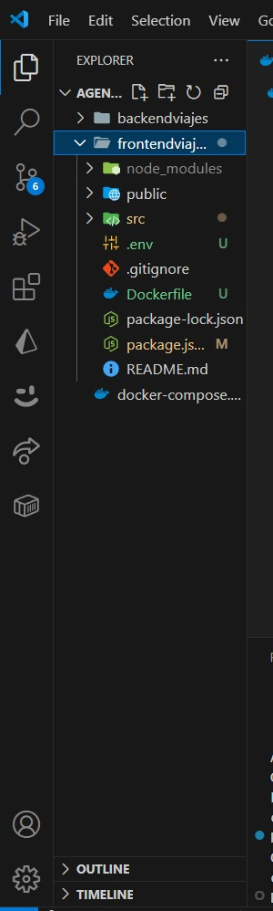

# 1. Título  
Contenerización de aplicación Frontend con React para visualización de datos desde una API REST en contenedor Backend

# 2. Tiempo de duración  
120 minutos

# 3. Fundamentos

La contenerización de aplicaciones es una técnica clave en el desarrollo moderno de software, que permite empaquetar una aplicación y todas sus dependencias en un contenedor ligero, portable y reproducible. Docker es una de las herramientas más utilizadas para esto. Esta práctica se centra en contenerizar una aplicación frontend hecha en React y un backend con una API REST, ambos comunicándose entre sí mediante una red de Docker.

**Frontend con React**: React es una biblioteca de JavaScript para construir interfaces de usuario. En esta práctica se utiliza para mostrar los datos en forma de tabla, obtenidos desde una API.

**Backend con API REST**: Una API REST (Representational State Transfer) permite que diferentes sistemas se comuniquen a través de solicitudes HTTP. Nuestro backend expone endpoints que devuelven los datos de una entidad específica.

**Docker**: Es una plataforma que permite crear, probar y desplegar aplicaciones mediante contenedores. Un contenedor encapsula el código, las dependencias y la configuración de una aplicación, lo que facilita su ejecución en cualquier entorno que tenga Docker instalado.

**Docker Compose**: Herramienta para definir y correr múltiples contenedores Docker. Se utiliza un archivo `docker-compose.yml` para levantar tanto el backend como el frontend y asegurar que se comuniquen mediante una red definida.

# 4. Conocimientos previos

Para realizar esta práctica el estudiante necesita tener claros los siguientes conceptos y habilidades:

- Comandos básicos de Linux (cd, mkdir, ls, touch, etc.)
- Uso de navegador y herramientas de desarrollo
- Conocimientos básicos de React (componentes, props, hooks)
- Conceptos de APIs REST y peticiones HTTP (GET)
- Uso de Docker CLI y Docker Compose
- Configuración de `Dockerfile` y `docker-compose.yml`

# 5. Objetivos a alcanzar

- Implementar contenedores con React y Node.js usando Docker.
- Manipular archivos de configuración Docker (`Dockerfile`, `docker-compose.yml`).
- Mostrar una tabla en React que consuma datos desde una API REST alojada en otro contenedor.
- Asegurar la comunicación entre contenedores mediante red Docker.

# 6. Equipo necesario

- Computador con sistema operativo Windows / Linux / Mac
- Cuenta en Docker Hub o Docker Play
- Docker v24.x instalado
- Navegador web (Chrome, Firefox)
- Editor de código (Visual Studio Code)
- Conexión a internet

# 7. Material de apoyo

- [Documentación oficial de Docker](https://docs.docker.com)
- [Guía de la asignatura](https://)
- [Cheat Sheet de comandos Linux](https://www.gnu.org/software/bash/manual/bash.html)
- [Documentación de React](https://react.dev)
- [Postman para probar API](https://www.postman.com/)

# 8. Procedimiento
### Paso 1 Crear el backend  y fronted 
- Crear el archivo index.js que contenga una API básica para devolver una lista de destinos turísticos.

 - Generar el archivo package.json.

- Instalar las dependencias necesarias: express y cors.

 ### Paso 2 :Crear Dockerfiles para frontend y backend 
- Crear un archivo Dockerfile para el backend con Express.
- Crear un archivo Dockerfile para el frontend con React.

 ### Paso 3 :En este paso vamos a crear un archivo docker-compose.yml que nos permitirá levantar el frontend y backend juntos con un solo comando.
 

 ### Paso 4: Ejecutar la aplicación

 
 - Este comando muestra una lista de todos los contenedores que están corriendo actualmente. Permite ver si el contenedor del backend y el del frontend están activos.

# 10. Bibliografía

- Docker Inc. (2024). *Docker Documentation*. Recuperado de: [https://docs.docker.com](https://docs.docker.com)  
- React Team. (2024). *React Official Documentation*. Recuperado de: [https://react.dev](https://react.dev)  
- González, P. (2023). *Guía práctica de contenedores con Docker*. Editorial EduTech.  
- W3Schools. (2024). *REST API Tutorial*. Recuperado de: [https://www.w3schools.com](https://www.w3schools.com)
